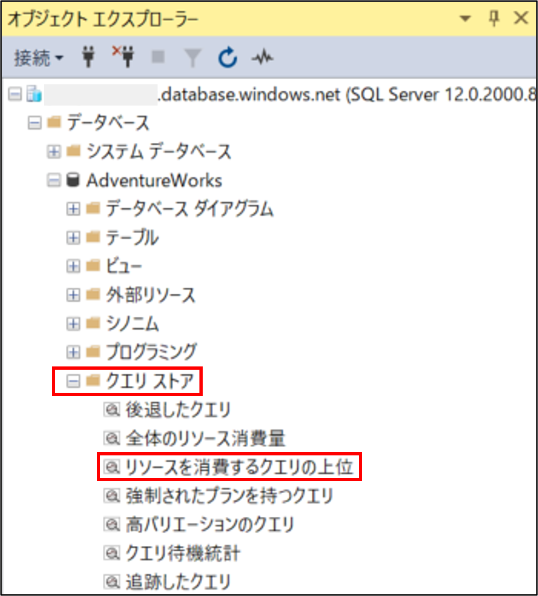
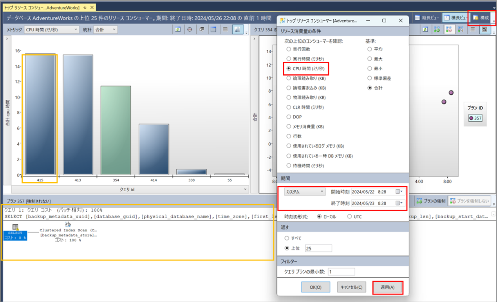

こんにちは。SQL Cloud サポート チームの宮崎です。
今回の投稿では、Azure SQL Database (SQL DB) において、CPU 使用率が高騰した際の調査方法を紹介します。

<!-- more -->

## はじめに
---
必ずしも CPU 使用率が高いことが悪いわけでは無く、CPU 使用率が高いことは割り当てられた CPU リソースを有効に使用できているということでもあります。
CPU 使用率が高騰しクエリの実行時間や業務に影響を及ぼす場合は、原因調査や対処をご検討ください。

## CPU 負荷が高いクエリの特定（過去の事象の場合）
---
クエリの実行情報を記録する [クエリストア](https://learn.microsoft.com/ja-jp/sql/relational-databases/performance/monitoring-performance-by-using-the-query-store?view=sql-server-ver16) を使用することで、過去に実行されたクエリのパフォーマンス情報（実行時間やリソース負荷 等）を SQL Server Management Studio（SSMS）の GUI や T-SQL クエリで確認することができます。

> [!NOTE]
> SQL DB ではクエリストアは既定で有効となります。ただし、クエリストアの既定値ではすべてのクエリの情報を記録しておらず、また、既定のデータの保持期間やクエリストアサイズの上限の設定により、古いデータは削除されている可能性があります。SQL DB のクエリストアの既定値については [Azure SQL Database のクエリ ストアの既定値](https://learn.microsoft.com/ja-jp/sql/relational-databases/performance/manage-the-query-store?view=sql-server-ver16&tabs=ssms#QueryStoreOptions) を参照ください。

### SSMS の GUI で確認する方法

SSMS より対象の SQL サーバー/データベースに接続し、以下図のように "クエリストア" から "リソースを消費するクエリの上位" をダブルクリックします。



クエリストアより、リソースを多く消費したクエリの情報が表示されるため、画面右上の "構成" を選択し「リソース消費量の条件」 にて "CPU 時間" を選択し「期間」にて事象が発生した日時を指定し、適用/OK を選択します（以下図の赤枠箇所）。

画面左側の棒グラフにて CPU 負荷の高い順（集計期間における累積 CPU 時間の長い順）にクエリが表示され、棒グラフを選択することで画面下に該当のクエリの実行プラン（クエリ実行のアルゴリズム）やクエリテキストが表示されます（以下図のオレンジ枠箇所）。
なお、複数の実行プランが生成されている場合は、画面右側に複数の色形をした実行プランがプロットされるため、その各プランを選択することで、画面下部に選択した実行プランの内容が表示されます（実行プランが変わることで CPU 負荷の差が出る場合もあるため、併せて確認することも有用です）。



### T-SQL クエリで確認する方法

対象の SQL DB に SSMS などのアプリケーションから接続し、以下 T-SQL を実行することでクエリストアから CPU 負荷の高いクエリを確認できます。
以下のクエリ例では、@startDate、@endDate パラメーターにて対象の日時の範囲を UTC 時刻で指定します。

```CMD
DECLARE @startDate datetime;
DECLARE @endDate datetime;
 
SET @startDate = '2024-08-08 23:00:00.000' -- 事象発生の開始日時を UTC 時刻にて指定
SET @endDate = '2024-08-10 02:00:00.000' -- 事象発生の終了日時を UTC 時刻にて指定

-- cpu_time, duration はマイクロ秒単位
SELECT TOP 30
   qsq.last_execution_time
  ,rsi.start_time
  ,rsi.end_time
  ,qsq.query_id
  ,qsp.plan_id
  ,qsq.query_hash
  ,qsp.query_plan_hash
  ,qsqt.query_sql_text
  ,ROUND(CONVERT(float, qsrs.avg_cpu_time*qsrs.count_executions),2) as total_cpu_time -- CPU 使用時間の合計（CPU 負荷）を確認
  ,qsrs.avg_cpu_time -- CPU 使用時間の平均
  ,qsrs.max_cpu_time -- CPU 使用時間の最大
  ,qsrs.min_cpu_time -- CPU 使用時間の最小
  ,qsrs.avg_logical_io_reads
  ,qsrs.max_logical_io_reads
  ,qsrs.min_logical_io_reads
  ,qsrs.avg_physical_io_reads
  ,qsrs.max_physical_io_reads
  ,qsrs.min_physical_io_reads
  ,qsrs.avg_duration
  ,qsrs.max_duration
  ,qsrs.min_duration
  ,qsrs.avg_dop
  ,qsrs.max_dop
  ,qsrs.count_executions
FROM sys.query_store_query_text qsqt
INNER JOIN sys.query_store_query qsq
ON qsqt.query_text_id = qsq.query_text_id
INNER JOIN sys.query_store_plan qsp
ON qsq.query_id = qsp.query_id
INNER JOIN sys.query_store_runtime_stats qsrs
ON qsp.plan_id = qsrs.plan_id
JOIN sys.query_store_runtime_stats_interval AS rsi
ON rsi.runtime_stats_interval_id = qsrs.runtime_stats_interval_id
WHERE rsi.start_time >= @startDate and rsi.end_time <= @endDate
ORDER BY ROUND(CONVERT(float, qsrs.avg_cpu_time*qsrs.count_executions),2) desc
```

> [!NOTE]
> 上記クエリを実行すると、CPU 負荷の他にも IO 負荷や実行時間などの情報が表示され、CPU 負荷以外にもリソース負荷があるか確認することができます。
> リソース負荷の高いクエリが特定でき、そのクエリの実行プランの内容を確認したい場合は、[過去のブログ記事](https://jp-azuresql.github.io/blog/Performance/show-execution-plan/) にて手順を紹介していますのでそちらをご参照ください。

## CPU 負荷が高いクエリの特定（事象が発生中の場合）
---
CPU 使用率の高騰が発生しているタイミングで CPU 負荷の高いクエリを特定する場合は、SSMS などのアプリケーションからデータベースに接続した上で、以下の T-SQL を実行し DMV（動的管理ビュー）から情報を取得出来ます。
以下の例では CPU 負荷が高い順に上位 30 個のクエリ情報を表示します。

```CMD
-- cpu_time, elapsed_time はミリ秒単位
SELECT TOP 30 s.session_id,
           r.status,
           r.cpu_time,
           r.logical_reads,
           r.reads,
           r.writes,
           r.total_elapsed_time,
           SUBSTRING(st.text, (r.statement_start_offset / 2) + 1,
           ((CASE r.statement_end_offset
                WHEN -1 THEN DATALENGTH(st.text)
                ELSE r.statement_end_offset
            END - r.statement_start_offset) / 2) + 1) AS statement_text,
           COALESCE(QUOTENAME(DB_NAME(st.dbid)) + N'.' + QUOTENAME(OBJECT_SCHEMA_NAME(st.objectid, st.dbid)) 
           + N'.' + QUOTENAME(OBJECT_NAME(st.objectid, st.dbid)), '') AS command_text,
           r.command,
           s.login_name,
           s.host_name,
           s.program_name,
           s.last_request_end_time,
           s.login_time,
           r.open_transaction_count
FROM sys.dm_exec_sessions AS s
JOIN sys.dm_exec_requests AS r ON r.session_id = s.session_id CROSS APPLY sys.dm_exec_sql_text(r.sql_handle) AS st
ORDER BY r.cpu_time DESC
```

[Azure SQL Database での高い CPU の診断とトラブルシューティング](https://learn.microsoft.com/ja-jp/azure/azure-sql/database/high-cpu-diagnose-troubleshoot?view=azuresql)

## 補足：CPU 使用率が高騰した際の一般的な対処法について
---
以下、CPU 使用率が高騰した際の一般的な対処法の一部についてご紹介します。

### A. 仮想コア数/DTU 数を増加させる
仮想コア数や DTU 数を増加させることで必要な CPU リソースを確保することが対処法の 1 つとなります。
事象解消を優先される場合は、仮想コア数、DTU 数を増加することをご検討ください。

> [!WARNING]
> 仮想コア数や DTU 数変更時には、数秒から数十秒程度のダウンタイムが発生する点にご留意ください。

### B. 同時に実行するクエリ数を減らし、負荷を分散させる
特定の期間やタイミングにおけるクエリの実行回数が多いことにより CPU 負荷が高騰した場合は、仮想コア数や DTU 数の増加に合わせて、業務要件上許容できる場合は、同時に実行するクエリの数を減らすことも対処としては有効の場合があります。
 
### C. 統計情報の更新を行う
クエリ実行に使用された実行プランが原因で CPU 負荷が増加しているような場合は（非効率なプランや古い統計情報に基づいたプランなどの場合）、該当のクエリが参照するテーブルの統計情報を更新することでも CPU 負荷を軽減できる場合があります。
統計情報を更新することで、最新のデータ分布に基づいた実行プランが生成されるため、結果的に CPU 負荷の低いプランが生成される可能性が有ります。
 
統計情報を更新するクエリサンプル
```CMD
--特定オブジェクトの統計情報を更新
UPDATE STATISTICS <テーブル名 or インデックス付きビュー名>;
```
 
### D. クエリのチューニングを行う
仮想コア数、DTU 数の増加や統計情報の更新でも CPU 負荷が改善しない場合は、インデックスの見直しや並列度の変更、または、クエリテキストの修正といったクエリのチューニングをご検討ください。

<font color="LightGray">キーワード：#リソース使用率高騰 #トラブルシューティングガイド #原因調査 #対処方法</font>