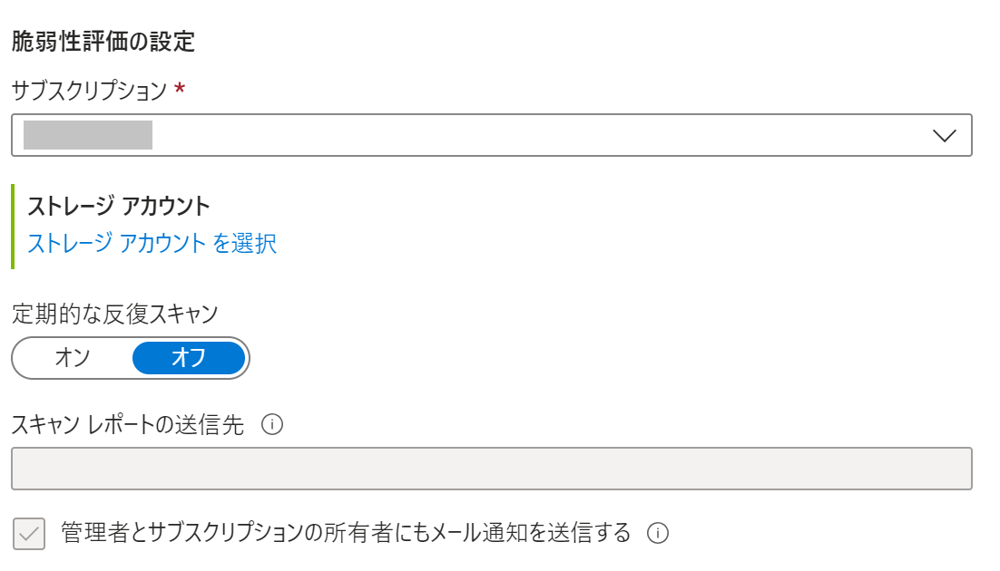

こんにちは。SQL Cloud サポート チームの陳です。

今回の投稿では、Azure SQL Database (SQL DB)、SQL Managed Instance (SQL MI) における脆弱性評価に関してご案内します。

<!-- more -->

## 脆弱性評価とは
---

SQL DB、SQL MI の脆弱性評価はデータベースの潜在的な脆弱性を検出、追跡、修復するのに役立つ、構成が容易なサービスであり、データベースの設定が**意図通りであることの確認を促すものです**。脆弱性評価の結果によりセキュリティに影響するデータベースまたはサーバーレベルの設定を容易にレビューできます。 

脆弱性評価はあくまでデータベースのセキュリティを高めるための推奨事項となりますので、ご要件に合致しない場合や不要と判断される場合は、ベースラインとして選択することで、以降、対象の推奨事項を許容します。

[SQL 脆弱性評価は、データベースの脆弱性を特定するのに役立ちます](https://learn.microsoft.com/ja-jp/azure/defender-for-cloud/sql-azure-vulnerability-assessment-overview)
[SQL 脆弱性評価ルール リファレンス ガイド](https://learn.microsoft.com/ja-jp/azure/defender-for-cloud/sql-azure-vulnerability-assessment-rules)


## 脆弱性評価の運用に関して
---

SQL DB では脆弱性評価の高速構成を用いてストレージ アカウントなしで脆弱性評価を有効化することができます。また、ストレージ アカウントを利用してクラシック脆弱性評価を有効にすることもできます。その一方、SQL MI では、現在、ストレージ アカウントを利用した脆弱性評価のクラシック構成のみが利用可能です。

[Azure SQL データベースで脆弱性評価を有効にする](https://learn.microsoft.com/ja-jp/azure/defender-for-cloud/sql-azure-vulnerability-assessment-enable)
[高速構成とクラシック構成の違いは何ですか。](https://learn.microsoft.com/ja-jp/azure/defender-for-cloud/sql-azure-vulnerability-assessment-overview#whats-the-difference-between-the-express-and-classic-configuration)


### 高速構成を利用する場合
---
SQL DB にて脆弱性評価の高速構成を利用する場合、ポータルで対象データベースを開き、「Microsoft Defender for Cloud」を選択し、脆弱性評価の高速構成で「Enable」を押します。


脆弱性評価の高速構成を行った場合、本記事を公開した 2023 年 8 月時点では、ポータルでは無効化できませんため、PowerShell スクリプトを実行し無効化してください。 
後述の[脆弱性評価の高速構成を無効化するスクリプト](#脆弱性評価の高速構成を無効化するスクリプト)より無効化するスクリプトを利用ください。

### クラシック構成を利用する場合
---
SQL MI にて脆弱性評価のクラシック構成を利用する場合は、ポータルより対象インスタンスを開き、「Microsoft Defender for Cloud」を選択し、画面に表示された「構成」をクリックし、「脆弱性評価の設定」項目より脆弱性評価の結果を保存するストレージを指定し脆弱性評価を設定します。



SQL DB にて脆弱性評価のクラシック構成を利用する場合は、高速構成を無効化したうえ、以下の PowerShell スクリプトで設定します。PowerShell スクリプトで脆弱性評価を有効化した後、ポータルの「Microsoft Defender for Cloud」の「構成」より設定結果を確認でき、これ以降はポータル上で設定を変更することも可能です。

```CMD
Update-AzSqlServerVulnerabilityAssessmentSetting `
-ResourceGroupName "リソースグループ名" `
-ServerName "サーバー名"`
-StorageAccountName "ストレージ名" `
-ScanResultsContainerName "コンテナー名" `
-RecurringScansInterval Weekly `
-EmailAdmins $true `
-NotificationEmail @("スキャン レポートの送信先メールアドレス")
```


## 脆弱性評価の高速構成を無効化するスクリプト

```CMD
$SubscriptionId = "サブスクリプション ID" 
$ResourceGroupName = 'リソースグループ名'
$ServerName = 'サーバー名'
$Force = $false
$APIVersion = "2022-05-01-preview"

function SendRestRequest(
    [Parameter(Mandatory=$True)]
    [string] $Method, 
    [Parameter(Mandatory=$True)]
    [string] $Uri, 
    [parameter( Mandatory=$false )]
    [string] $Body = "DEFAULT")
{  
    $AccessToken = Get-AzAccessToken
    $Token = "Bearer $($AccessToken.Token)"

    $headers = @{
        'Authorization' = $Token
    }

    $Params = @{
         Method = $Method
         Uri = $Uri
         Headers = $headers
         ContentType = "application/json"
    }

    if(!($Body -eq "DEFAULT"))
    {
      $Params = @{
         Method = $Method
         Uri = $Uri
         Body = $Body
         Headers = $headers
         ContentType = "application/json"
         }
    }
  
    Invoke-RestMethod @Params
}

function SetSqlVulnerabilityAssessmentServerSetting($SubscriptionId, $ResourceGroupName, $ServerName){
        $Uri = "https://management.azure.com/subscriptions/" + $SubscriptionId+ "/resourceGroups/$ResourceGroupName/providers/Microsoft.Sql/servers/" + $ServerName +"/sqlVulnerabilityAssessments/default?api-version=" + $APIVersion
    $Body = @{
        properties = @{
            state = "Disabled"
        }
    }

    $Body = $Body | ConvertTo-Json
    return SendRestRequest -Method "Put" -Uri $Uri -Body $Body
}
$Respond = SetSqlVulnerabilityAssessmentServerSetting -SubscriptionId $SubscriptionId -ResourceGroupName $ResourceGroupName -ServerName $ServerName
```